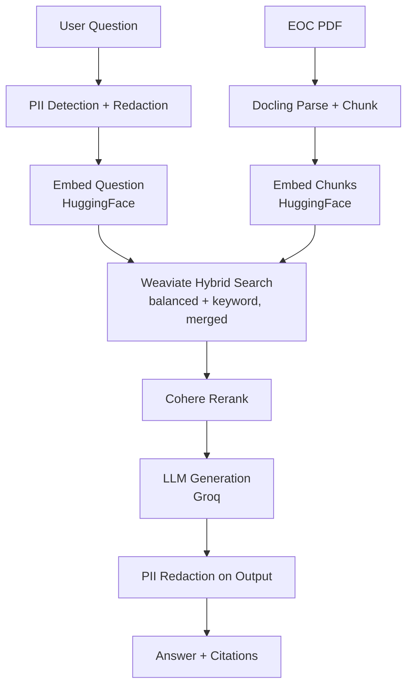

# Health Document Summarizer (RAG)

A RAG system that answers questions about a health insurance Evidence of
Coverage (EOC) document, with page-level citations — built as a hands-on
portfolio project focused on production-grade evaluation and safety
guardrails, not just retrieval + generation.

> **Q:** What is the in-network deductible for a subscriber with only-subscriber coverage?
> **A:** $1,700 for in-network care under Subscriber Only Coverage. *(Source: Anthem_EOC.pdf, Page 21)*

## Architecture



**v2 roadmap** (built as standalone components, not yet wired into the live
pipeline): prompt injection detection, live citation grounding check.
See [`FINDINGS.md`](./FINDINGS.md) for details.

## Key results

| Check | Method | Score |
|---|---|---|
| Context Recall | RAGAS (LLM-judged) | 0.93 |
| Context Precision | RAGAS (LLM-judged) | 0.88 |
| Faithfulness | RAGAS (LLM-judged) | 0.56–0.62 |
| Citation Correctness | Custom, deterministic | 95% |

Full methodology, the 20-question golden dataset, and honest documented
limitations: see [`FINDINGS.md`](./FINDINGS.md).

## Stack

Docker (Weaviate) · Modal (cloud GPU processing) · Docling · sentence-transformers ·
HuggingFace (embeddings) · Weaviate · Cohere Rerank · Groq (generation) ·
RAGAS · Microsoft Presidio + spaCy · GitHub Actions

## Run it

```bash
pip install -r requirements.txt
python src/code/ingest_documents.py     # one-time, loads chunks into Weaviate
python src/code/run_eval.py             # runs the full eval suite
```