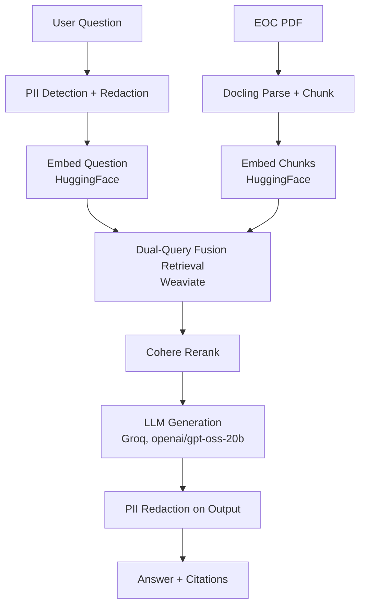

# Health Document Summarizer (RAG)

A RAG system that answers questions about a health insurance Evidence of
Coverage (EOC) document, with page-level citations — built as a hands-on
portfolio project focused on production-grade retrieval and evaluation.

> **Q:** What is the in-network deductible for a subscriber with only-subscriber coverage?
> **A:** $1,700 for in-network care under Subscriber Only Coverage. *(Source: Anthem_EOC.pdf, Page 21)*

## Architecture



**Not yet wired into the live pipeline** (built and tested standalone): a
prompt injection detection guardrail, and a citation-grounding guardrail
(currently used as part of the eval suite only, not as a live per-query
check).

### Retrieval: dual-query fusion

Each question runs through Weaviate **twice**, not once:
1. A balanced hybrid search (`alpha=0.5` — half vector similarity, half keyword match)
2. A pure-keyword search (`alpha=0.0`)

Results from both are merged and deduplicated by chunk ID before reranking,
so a chunk only needs to be found by *either* method to reach the
reranker — rather than one blended score having to satisfy both keyword
precision and semantic recall at once. (Re-tested this directly after
initial development — see note below.)

## Evaluation

Five checks, run against a hand-verified 20-question golden dataset:

| Check | Method | Measures |
|---|---|---|
| Context Recall | RAGAS (LLM-judged) | Did retrieval get everything needed? |
| Context Precision | RAGAS (LLM-judged) | Was what was retrieved relevant? |
| Faithfulness | RAGAS (LLM-judged) | Is the answer grounded in retrieved context? |
| Citation Correctness | Custom, deterministic | Does the cited page match the source? |
| Threshold check | Custom, deterministic | Gates CI — fails the build if any score drops below a set baseline |

**Latest scores (dual-query fusion):**

| Metric | Score |
|---|---|
| Context Recall | 0.80 |
| Context Precision | 0.91 |
| Faithfulness | 0.57 |
| Citation Correctness | 84% |

Scores vary run-to-run (LLM-judge variance is a known factor with RAGAS's
LLM-as-judge metrics — worth averaging multiple runs before drawing
conclusions from a single score).

## Stack

Docker (Weaviate) · Modal (cloud GPU processing) · Docling ·
sentence-transformers · HuggingFace (embeddings) · Weaviate · Cohere Rerank
· Groq (generation) · RAGAS · Microsoft Presidio (PII) · GitHub Actions

## Run it

```bash
pip install -r requirements.txt
python -m spacy download en_core_web_sm
python src/code/ingest_documents.py     # one-time, loads chunks into Weaviate
python src/code/run_eval.py             # runs the full eval suite
```
